# Module 1
Welcome to Module 1 of the One Day Introduction to XAML course. We are glad you are here!. This module will walk through a few steps to get started and then we will dive into creating the basic application. 

### TOC
1. [Orientation](#orientation)
1. [Introduce ShellPage](#shellpage)
1. [Add a NavigationView](#navview)

## Task 1: Orientation<a name="orientation"></a>

In this task you will ensure that you have a GitHub account and the correct software installed to create a UWP application. You will also copy the course files to your PC so you can access source, completed solutions, etc.

1. Create GitHub account [https://github.com/join](https://github.com/join)
1. Ensure environment
    1. Windows 10 (any edition) Fall Creators Update
    1. Visual Studio 2017 (any edition) 15.4 or later
    > **Instructor Sync Point:** Discuss Windows 10 SDK versions and compatability

1. > **TODO**: Download the resources from the GitHub repository or from the USB stick.

## Task 2: Introduce ShellPage<a name="shellpage"></a>

In this task, you will create a new blank UWP project and modify the project so that it it utilizes a single shell page. You will learn about the default `App,xaml.cs` file contents and why we modify it.

Let's jump into the steps:

1. First, let's create a Blank UWP app. Open the `New Project` dialog and select `Visual C#` and `Windows Universal` and then choose the `Blank App (Universal Windows)` template.

    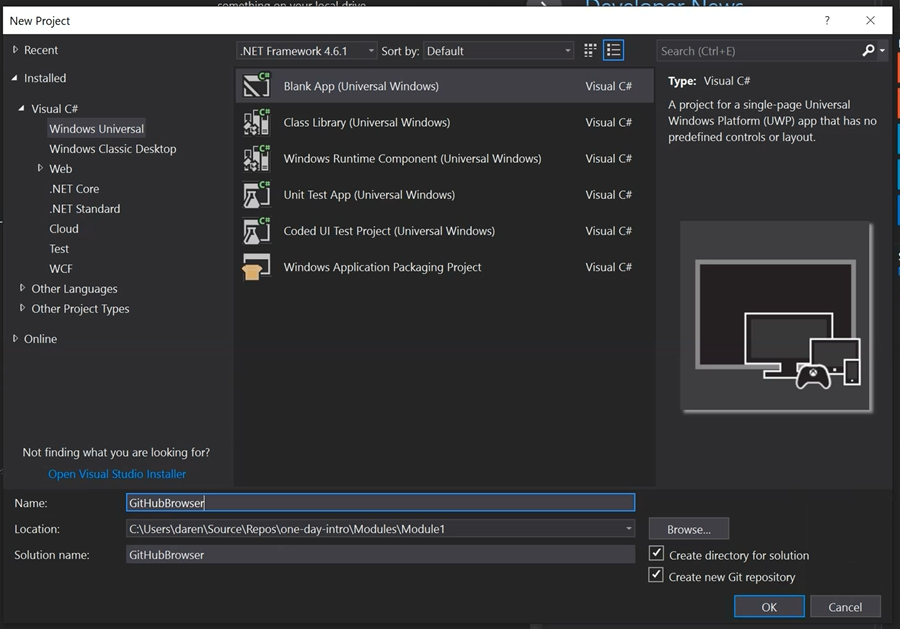

2. Name it `GitHubBrowser` and hit `OK`.
3. Select Fall Creators Update as both Target and Minimum Version.

    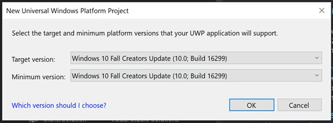

    > **Instructor Sync Point:** Discuss Windows 10 SDK versions and compatability
    
4. Open Solution Explorer. Select `View/Solution Explorer` 
5. Delete the `MainPage.xaml` file (this will also delete `MainPage.xaml.cs`);
6. Create `Views` folder;
7. Create a new XAML page called `ShellPage` in the `Views` folder.

    > Right-click the `Views` folder, select `Blank Page` in the `Add New item` dialog.

    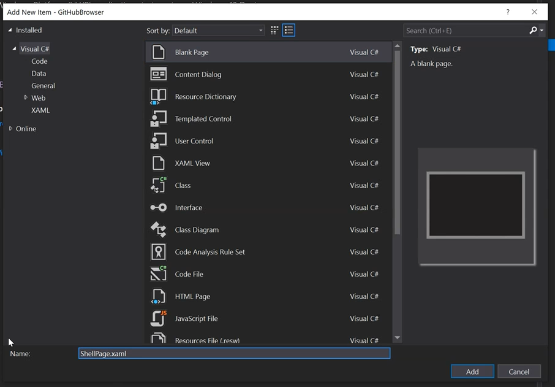

    You will see two files added to the `Views` folder - `ShellPage.xaml` and `ShellPage.xaml.cs`. 
    
    > You may have to expand the `ShellPage.xaml` files to see the other - `ShellPage.xaml.cs` is known as the "code-behind" for the xaml file.

8. Open the `ShellPage.xaml` file and replace the default grid with the following XAML code:

    ```xml
    <Grid Background="{ThemeResource ApplicationPageBackgroundThemeBrush}">
        <TextBlock>Hello, World!</TextBlock>
    </Grid> 
    ```

9. Open `App.xaml.cs` in the root.

    > Expand `App.xaml` to see its `App.xaml.cs` code-behind file

10. Replace the entire `App` class with the following C# code:

    ```csharp
    sealed partial class App : Application
    {
        public App()
        {
            InitializeComponent();
        }

        protected override void OnLaunched(LaunchActivatedEventArgs e)
        {
            var shell = new ShellPage();
            Window.Current.Content = shell;
            Window.Current.Activate();
        }
    } 
    ```

11. Note the error indicator under ShellPage. This is the C# language service indicating it cannot resolve `ShellPage` because its namespace is not in scope.

    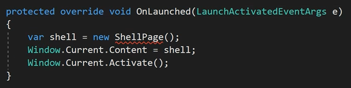

12. Add the using statement to Views.

    1. Method 1: use CTRL+. to open the `Quick Actions and Refactorings` dropdown. Select `using GitHubBrowser.Views;`
    2. Method 2: Manually type `using GitHubBrowser.Views;` at the top of the class file.

13. Test your app.

    1. Build your app by hitting `F6`
    2. Run your app by hitting `F5` 

    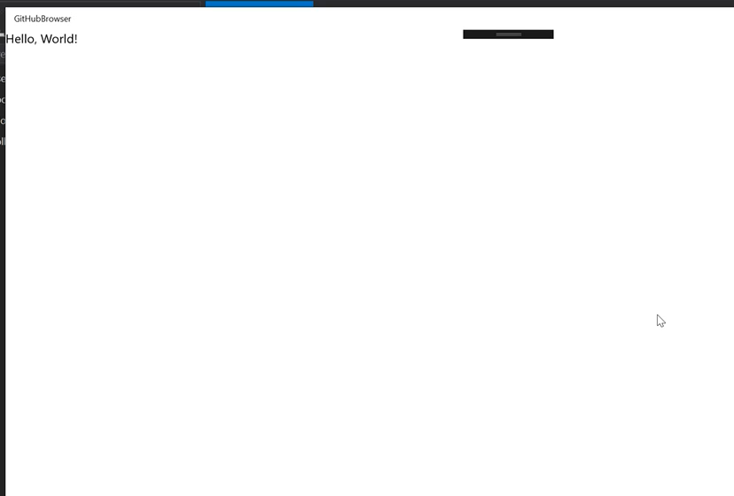

14. Change the app theme to `Dark`

    1. Open `App.xaml`
    2. Replace the `RequestedTheme` default value of `Light` with `Dark`

    ```xml
    <Application
    x:Class="GitHubBrowser.App"
    xmlns="http://schemas.microsoft.com/winfx/2006/xaml/presentation"
    xmlns:x="http://schemas.microsoft.com/winfx/2006/xaml"
    xmlns:local="using:GitHubBrowser"
    RequestedTheme="Dark">
    </Application>      
    ```

    3. Test your app again by running it.

    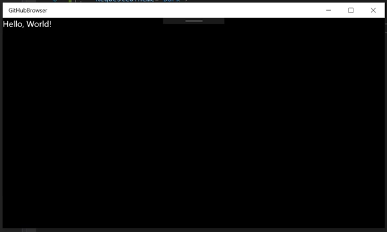

## Task 3: Add a NavigationView<a name="navview"></a>

In this task, you will add a navigation control to the application. This control `NavViewEx` is derived from the framework control `NavigationView` and simplifies setting up navigation. You will then go on to add some simple pages that will act as placeholders so you can test navigation and add more functionality in later labs.

Let's proceed:

1. Reopen the solution if you have closed it.
1. Add a folder called `Controls` to your solution
1. Copy `NavViewEx.cs` into your `Controls` folder

    > This file is located in resources `Module1/Files`

    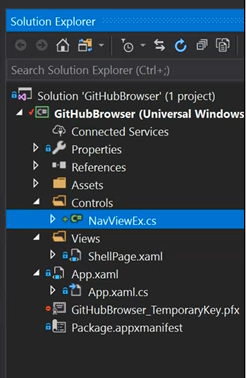

    > **Instructor Sync Point:** Describe `NavigationView` and `NavViewEx`

1. Add new pages in the `Views` folder

    1. `HomePage.xaml`
    1. `CodePage.xaml`
    1. `IssuesPage.xaml`
    1. `PullPage.xaml`
    1. `SettingsPage.xaml`

    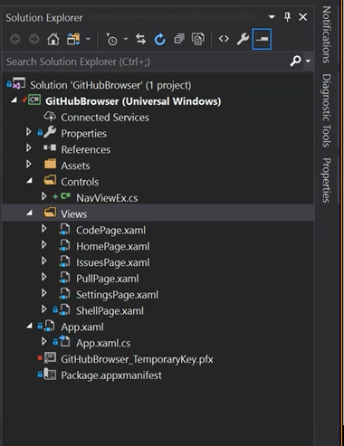

1. Add the following namespace and property **to each new page**. Be sure to change the value of the `Header` property to match the name of the xaml page, as below: 

    > **Instructor Sync Point:** Discuss `NavProperties` attached properties

    ```xml
    xmlns:controls="using:GitHubBrowser.Controls"
    controls:NavProperties.Header="Home page" 
    ```

    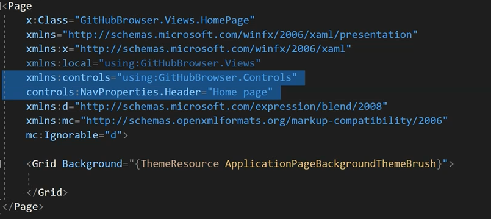

1. Open `ShellPage.xaml`

1. Add the following namespaces and `x:Name` directive to `ShellPage`

    > **Instructor Sync Point:** Discuss `x:Name` Page property and element binding

    ```xml
    xmlns:controls="using:GitHubBrowser.Controls"
    xmlns:views="using:GitHubBrowser.Views"
    x:Name="ThisPage"
    ```

    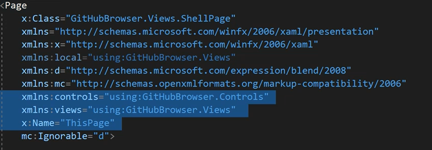

1. Copy the `Images` folder from resources into your solution

    Find the folder in `Module1/Files/Images`. Copy the folder with all the files, not the files individually. These images will be used as the icons in the Hamburger menu.

    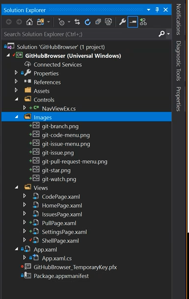

1. Find the default `Grid` and replace it with the Extended Navigation View code below:

    > Note: alternatively, this snippet can be also found in resources `Module1/Files/ShellPage_NavViewEx_Snippet.txt`

    Find:  

    ```xml
    <Grid Background="{ThemeResource ApplicationPageBackgroundThemeBrush}">
        <TextBlock>Hello, World!</TextBlock>
    </Grid> 
    ```

    Replace with:

    ```xml
    <controls:NavViewEx x:Name="MainNavigationView" x:FieldModifier="Public"
                        SettingsPageType="views:SettingsPage">

        <NavigationView.HeaderTemplate>
            <DataTemplate>
                <CommandBar>
                    <CommandBar.Content>
                        <Grid Margin="12,5,0,11" VerticalAlignment="Stretch">
                            <TextBlock Text="{Binding}" Style="{StaticResource TitleTextBlockStyle}" TextWrapping="NoWrap" VerticalAlignment="Bottom"/>
                        </Grid>
                    </CommandBar.Content>
                </CommandBar>
            </DataTemplate>
        </NavigationView.HeaderTemplate>

        <NavigationView.MenuItems>
            <NavigationViewItemHeader Content="Repository" />
            <NavigationViewItem controls:NavProperties.PageType="views:HomePage" 
                                controls:NavProperties.IsStartPage="True" 
                                Icon="Home" Content="Home">
            </NavigationViewItem>
            <NavigationViewItem controls:NavProperties.PageType="views:CodePage"  
                                Content="Code">
                <NavigationViewItem.Icon>
                    <BitmapIcon UriSource="/Images/git-code-menu.png" />
                </NavigationViewItem.Icon>
            </NavigationViewItem>
            <NavigationViewItem controls:NavProperties.PageType="views:IssuesPage"  
                                Content="Issues">
                <NavigationViewItem.Icon>
                    <BitmapIcon UriSource="/Images/git-issue-menu.png" />
                </NavigationViewItem.Icon>
            </NavigationViewItem>
            <NavigationViewItem controls:NavProperties.PageType="views:PullPage"  
                                Content="Pull Requests">
                <NavigationViewItem.Icon>
                    <BitmapIcon UriSource="/Images/git-pull-request-menu.png" />
                </NavigationViewItem.Icon>
            </NavigationViewItem>
        </NavigationView.MenuItems>

    </controls:NavViewEx>
    ```

1. Run your app to test it; hit `F5`

    1. Click on the buttons to navigate
    1. Notice the page Header matches your settings
    1. Hide and show the menu with the hamburger button
    1. Notice the menu's Acrylic background brush
    1. Change your app's width
    1. Notice how the menu auto-adapts

    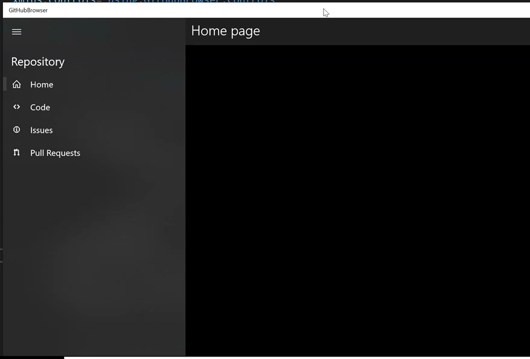

## Summary

In this module, you created the basic UWP application. You modified the app so that instead of creating a `Frame` and navigating to `MainPage`, the app just creates an instance of `ShellPage` and loads it directly into the application window content. You then changed the application default theme to Dark. You then went on to adding the `NavViewEx` control and implemented a very basic navigation to essentially empty pages.

Congratulations - Module 1 is complete. In the next module you will add authentication to the app and implement some services.

[Start Module 2](./Module2.md)
