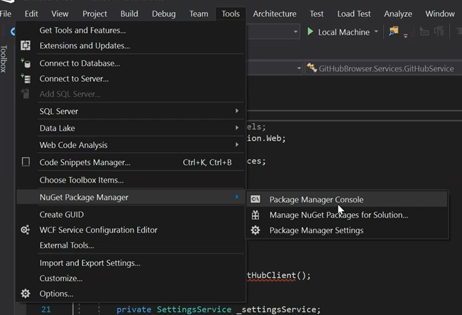
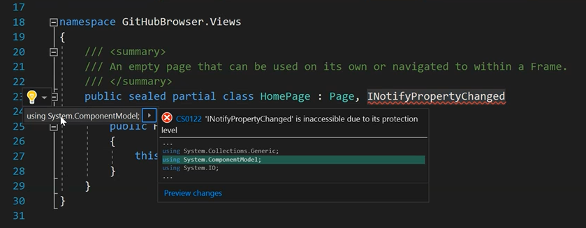
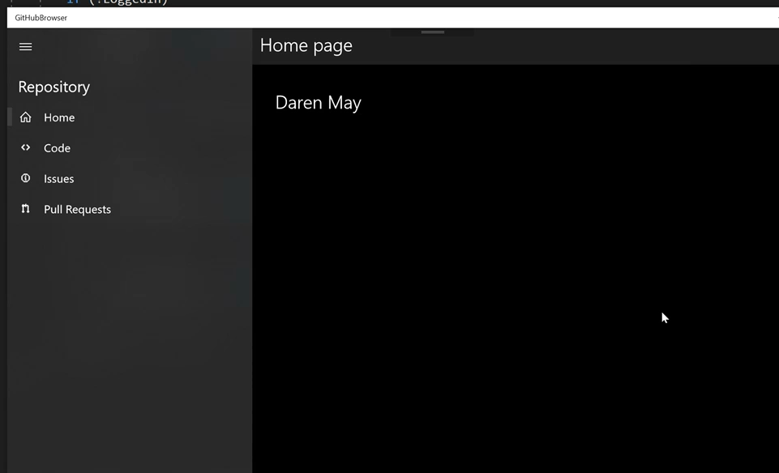

# Module 2
In this module, you will implement OAuth authentication to GitHub and add some essential services to the app.

### TOC
1. [Get your app's callback URI](#callback)
1. [Setup your app in Github](#github)
1. [Add services to your app](#services)
1. [Add authentication UI](#auth)
1. [Add automatic authentication](#auto)

## Task 1: Get your app's callback URI<a name="callback"></a>

In this task, you will discover how straightforward it is to obtain the callback URI for your app. A callback URI is used as part of the OAuth authentication flow and the `WebAuthenticationBroker` component detects when a redirect to that URI occurs so that your app can retrieve a single-use code for the next phase of the OAuth flow.

1. Place the following code in the constructor of `App.xaml.cs`.

    > This snippet is the easiest way to get your callback URI, and once you have it, you can remove this one-time code from your app. 

    ```csharp
    var callbackUri = Windows.Security.Authentication.Web.WebAuthenticationBroker.GetCurrentApplicationCallbackUri(); 
    ```

1. Add a breakpoint (hit `F9`) on the new line.  
1. Run your app and look at the reulting value.

    > Note: the debug value will have curly braces at the start and the end `{ms-app://value}`, be sure and remove them so your URI is the correct syntax, like this `ms-app://value`. 

    

1. Copy your `Callback URI` to somewhere handy...

## Task 2: Setup your app in Github<a name="github"></a>

In this task, you will use your GitHub account to register the application you are creating so that it can participate in the GitHub authentication flow. After the app is registered, you will receive two pieces of information that are essential for your app to interact with certain GitHUb APIs. 

1. Open the following url: [https://github.com/settings/applications/new](https://github.com/settings/applications/new)

    1. You only need to provide four values
        1. **Application name** Naming convention XU_Oredev2017_\<YourName\>
        1. **Homepage URL** http://xamlu.com/XU_Oredev2017_\<YourName\>
        1. **Application description** "Sample app for Oredev"
        1. **Authorization Callback URL** Use the result from Task 1 above

        

    1. Click `Register application`.
    1. Copy *your* `Client Id` and `Client Secret` to somewhere handy

    

## Task 3: Add services to your app<a name="services"></a>

In this task, you will add a NuGet package that will aid in consuming the GitHub APIs as well as add some services to you app. The services will allow your app to save settings across sessions and show an example of wrapping an external API to make it more suitable for your needs.

1. Add a reference to the `Xamlu.Demo.GitHubLibrary` NuGet package 

    1. Open the NuGet Package Manager Console
    
    

    2. Type the following into the console: `Install-Package XamlU.Demo.GithubLibrary`

    

    > **Instructor Sync Point:** Discuss the source for `GitHubLibrary`

    > **Instructor Sync Point:** Discuss `HttpClient` and show the debug diagnostics

1. In Visual Studio, add a folder `Services` at the root level of your project.
1. Copy `SettingsService.cs` and `GithubService.cs` to the `Services` folder.
    
    > Find both files in `Module2/Files`

1. Update values in `SettingsService.cs`

    

    1. Replace `<your client id>` with your client id (from above)
    2. Replace `<your secret>` with your secret (from above)

    

## Task 4: Add authentication UI<a name="auth"></a>

Now that you have added the services, it is time to start to actually add authentication to your app. In this task, the `HomePage` will be modified to display the login UI and to include the logic to allow you to login. You will see how to change the UI based upon different states.

1. Open `homePage.xaml`
1. On the root `Grid`, add the attribute `Padding="32"`
1. Paste the following `WaitUI` XAML inside the grid

    > This block of XAML will show while the user logs in. 

    ```xml
    <StackPanel x:Name="WaitUI" Visibility="{x:Bind ShowWaitUI, Mode=OneWay}">
        <ProgressBar IsIndeterminate="True" />
        <TextBlock Style="{StaticResource TitleTextBlockStyle}" Text="Please wait" />
    </StackPanel> 
    ```

1. Paste the following `LoggedOutUI` XAML below the `WaitUI` just added.

    > This block of XAML will show when the suer is logged out. 

    ```xml
    <StackPanel x:Name="LoggedOutUI" Visibility="{x:Bind ShowLoggedOutUI, Mode=OneWay}">
        <TextBlock Style="{StaticResource TitleTextBlockStyle}" Text="Authentication is required" />
        <Button Content="Login now" Click="{x:Bind LoginAsync}" />
    </StackPanel> 
    ```

1. Paste the following `LoggedInUI` XAML below the `LoggedOutUI` just added.

    > This block of XAML will show when the user is logged in. 

    ```xml
    <StackPanel x:Name="LoggedInUI" Visibility="{x:Bind ShowLoggedInUI, Mode=OneWay}">
        <TextBlock Style="{StaticResource TitleTextBlockStyle}" x:Name="UserNameTextBlock" Text="{x:Bind User.name, Mode=OneWay}" />
    </StackPanel> 
    ```

    > **Instructor Sync Point:** Discuss Binding vs x:Bind, INPC and Converters

    > **Instructor Sync Point:** Discuss `Visibility` vs Visual States.

1. Open `HomePage.xaml.cs`

1. Implement `INotifyPropertyChanged`

    > HomePage inherits from page. We also want to add the declaration of the INotifyPropertyChanged interface to our HomePage and implement it.

    1. Add `INotifyPropertyChanged` to the class declaration

    > Note: you can use the refactoring tool by hitting `CTRL+.`

    

    1. Implement the interface. 
    
    

1. Copy the following code into `HomePage.xaml.cs`.

    > Note: alternatively, this snippet can be also found in resources `Module2/Files/HomePage_Auth_Snippet.txt`

    

1. Fix the namespaces

    

    Add the following:

    ```csharp
    using System.Threading.Tasks; 
    ```

    > Note: you can use the refactoring tool by hitting `CTRL+.`

1. Test your app, hit `F5`

    1. Click the `Login now` button
    1. Congratulations.

    

    

    

    

## Task 5: Add automatic authentication<a name="auto"></a>

In the last task, you added the ability to login, but right now you need to hit login each time you start the app. Surely there must be a better way? In this task you will add the simple code that will login automatically.

1. Add a `Loaded` handler to HomePage.xaml.cs

    > Note: you can use the refactoring tool by hitting `CTRL+.`

    ```csharp
    public HomePage()
    {
        this.InitializeComponent();
        this.Loaded += this.HomePage_Loaded;
    }

    private async void HomePage_Loaded(object sender, RoutedEventArgs e)
    {
        await this.LoginAsync();
    } 
    ```
    Note that the handler is an asynchronous method, decorated with the `async` modifier so `LoginAsync` can be awaited. In addition, asynchronous methods, as a rule of thumb, do not return void, but `event` handlers do not need to comply to this rule, since they can't.

    

    > **Instructor Sync Point:** Discuss page/control lifecycle events such as Loaded

## Summary

Phew - you covered a lot of ground in this module! You intergrated a 3rd party library, wrapped it with your own service to make it easier to use and then added the ability to save settings. You then added a UI for login and learnt one way to make the UI respond to changes in the application state, and then you learnt how the `Loaded` event can be used to run code when a `Page` is displayed.

[Start Module 3](./Module3.md)
