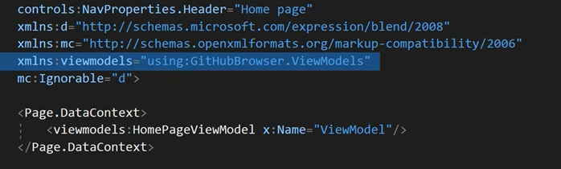
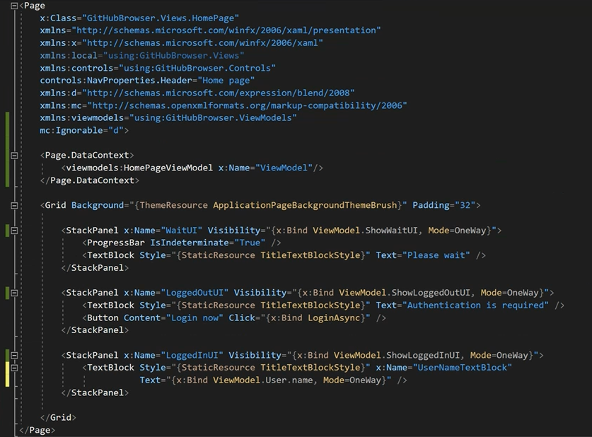
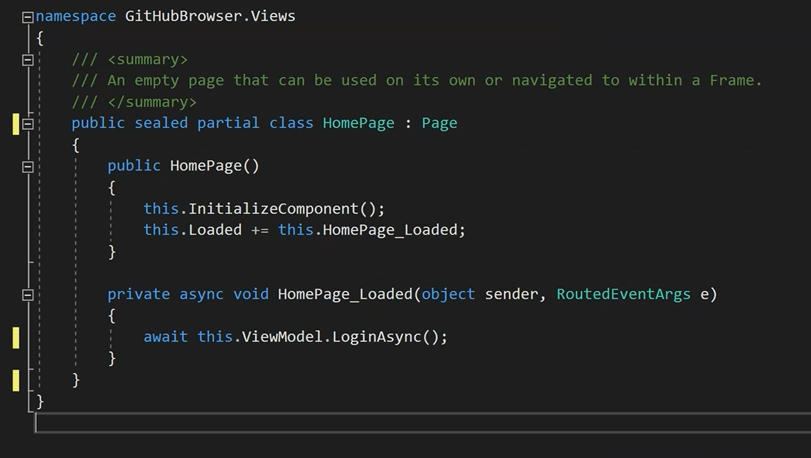
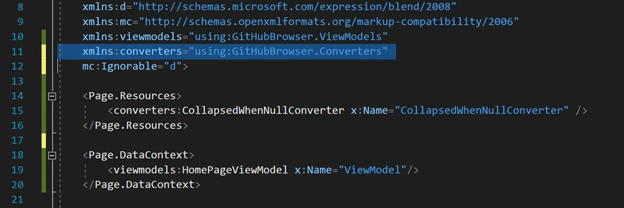
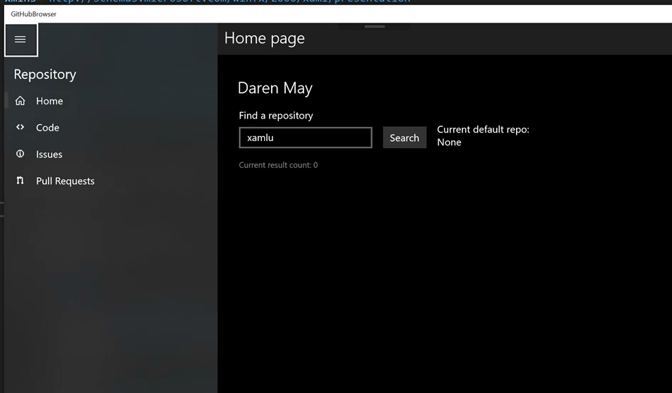
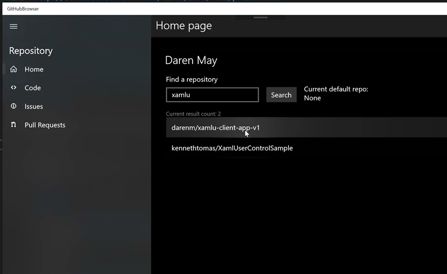
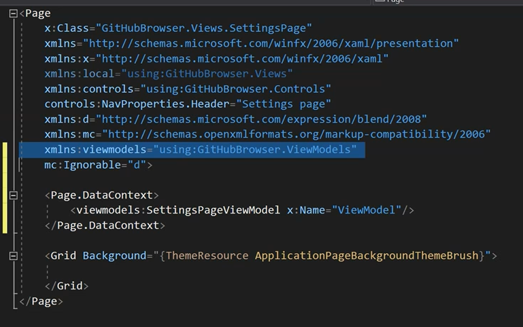
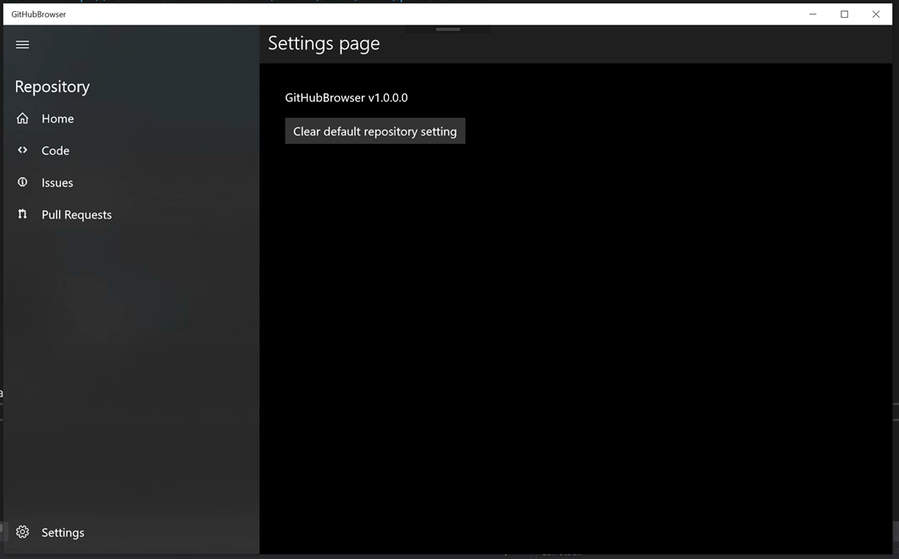

# Module 3
In this module, you will add a Model-View-ViewModel implementation to the application, implement a simple settings service and add a repository search function.

### TOC
1. [Add MVVMLight NuGet package](#mvvmlight)
1. [Add a ViewModel](#viewmodel)
1. [Implement Search](#search)
1. [Implement Settings](#settings)

## Task 1: Add a reference to the MVVMLight NuGet package<a name="mvvmlight"></a>

In this task, you will add the `MVVMLightLibs` NuGet package.This library introduces a basic Model View View-Model (MVVM) framework allowing your app to implement `INotifyPropertyChanged` with a common `ObservableObject` base class, use a concrete `RelayCommand` implementing `ICommand`, and providing a Messenger service (used in a later module).

1. Add a reference to the `MVVM Light` NuGet package.

    1. Open the NuGet Package Manager Console

    

    1. Type the following into the console: `Install-Package MvvmLightLibs`

    

## Task 2: Add a ViewModel<a name="viewmodel"></a>

In this task, you will move code from the `HomePage.xaml.cs` code-behind and create a ViewModel - `HomePageViewModel.cs`. You will see how binding makes this easy.

1. In Visual Studio, add a folder `ViewModels` at the root level of your project.

1. Copy `HomePageViewModel.cs` to the `ViewModels` folder.

    > Find the file in `Module3/Files`

1. Add a reference to `HomePageViewModel` in the `HomePage.xaml` markup, by setting the value of `Page.DataContext`, shown below. Ensure it has the name `ViewModel`.

    ```xml
    <Page.DataContext>
        <viewmodels:HomePageViewModel x:Name="ViewModel"/>
    </Page.DataContext> 
    ```

    The XAML above will require a new xml namespace declaration to your  ViewModels namespace, as shown in the image below.

    

1. Update your XAML bindings to point to the view-model instead of the code-behind. Note that `{x:Bind ShowWaitUI}`, as an example, is now `{x:Bind ViewModel.ShowWaitUI}`.

    > You can replace the entire body of `HomePage` with the following XAML.

    ```xml
    <StackPanel x:Name="WaitUI" Visibility="{x:Bind ViewModel.ShowWaitUI, Mode=OneWay}">
        <ProgressBar IsIndeterminate="True" />
        <TextBlock Style="{StaticResource TitleTextBlockStyle}" Text="Please wait" />
    </StackPanel>

    <StackPanel x:Name="LoggedOutUI" Visibility="{x:Bind ViewModel.ShowLoggedOutUI, Mode=OneWay}">
        <TextBlock Style="{StaticResource TitleTextBlockStyle}" Text="Authentication is required" />
        <Button Content="Login now" Click="{x:Bind ViewModel.LoginAsync}" />
    </StackPanel>

    <StackPanel x:Name="LoggedInUI" Visibility="{x:Bind ViewModel.ShowLoggedInUI, Mode=OneWay}">
        <TextBlock Style="{StaticResource TitleTextBlockStyle}" x:Name="UserNameTextBlock" Text="{x:Bind ViewModel.User.name, Mode=OneWay}" />
    </StackPanel> 
    ```

    

1. We can now remove the unused code in the `HomePage.xaml.cs` code-behind file:

    1. Open `HomePage.xaml.cs`
    1. Remove `INotifyPropertyChanged` from the class declaration.
    1. Modify the `HomePage_Loaded` handler to call `ViewModel.LoginAsync()`
    1. Delete the `PropertyChanged` event.
    1. Delete all the properties.
    1. Delete `LoginAsync()`

    

1. Run the app, hit `F5`.

    > **Instructor Sync Point:** Walkthough ViewModel, Separation of Concerns and Command Pattern

## Task 3: Implement Search<a name="search"></a>

So far, we haven't really added an real functionality - that changes now! In this task we will add the feature to be able to search GitHub for repositories that match a supplied search term.

1. In Visual Studio, add a folder `Converters` at the root level of your project.

1. Copy `CollapsedWhenNullConverter.cs` to the `Converters` folder.

    > Find the file in `Module3/Files`

1. Open `HomePage.xaml`

1. Add a reference to our new converter in `HomePage`.

    This converter will be used to hide and show a UI element based on the value of another property having a value or being null.

    ```xml
    <Page.Resources>
        <converters:CollapsedWhenNullConverter x:Name="CollapsedWhenNullConverter" />
    </Page.Resources>
    ```

    

    > **Instructor Sync Point:** Discuss Converters and implicit conversion

1. Replaced `LoggedInUI` with different XAML

    > The current `LoggedInUI` block shows only the name of the current user in a single `TextBlock`. The new snippet does the same, but adds search capabilities to find a GitHub repository and mark it as the default repository for other operations in the app.

    > This snippet can be found in resources `Module3/Files/HomePage_LoggedinUi_Snippet.txt`

    > **Instructor Sync Point:** Discuss `ListView` and `RelativePanel`

1. Run the app, hit `F5`

    1. Search for "xamlu"
    1. Notice the current repository is `None`
    1. Select the "darenm" repository
    1. Notice the repository details
    1. Make the repository your default
    1. Notice the current repository changed
 
    

    


## Task 4: Implement Settings<a name="settings"></a>

In this task, you will be adding a UI to the `SettingsPage` that will interact with the `SettingsService` so that you can update values that are persisted between application sessions. As you build the UI and the associated ViewModel, you will see how you can handle special cases for when a `Page` is being viewed in a designer or during run time.

 > **Instructor Sync Point:** Discuss Settings Service

1. Copy `SettingsPageViewModel.cs` to the `ViewModels` folder.

    > Find the file in `Module3/Files`

 > **Instructor Sync Point:** Discuss `DesignModeEnabled` & `RelayCommand`

1. Open `SettingsPage.xaml`

1. Add a reference to `SettingsPageViewModel` in the `SettingsPage.xaml` markup, by setting the value of `Page.DataContext`, shown below. Ensure it has the name `ViewModel`.

    ```xml
    <Page.DataContext>
        <viewmodels:SettingsPageViewModel x:Name="ViewModel"/>
    </Page.DataContext> 
    ```

    The XAML above will require a new xml namespace declaration to your `ViewModels` namespace, as shown in the image below.

    

1. Find the default `Grid` in `SettingsPage` and replace it with the Settings UI below:

    > Note: alternatively, this snippet can be also found in resources `Module3/Files/SettingsPage_Ui_Snippet.txt`

    Find:  

    ```xml
    <Grid Background="{ThemeResource ApplicationPageBackgroundThemeBrush}">

    </Grid> 
    ```

    Replace with:

    ```xml
    <Grid Background="{ThemeResource ApplicationPageBackgroundThemeBrush}">

        <StackPanel Margin="32">
            <TextBlock Text="{x:Bind ViewModel.Version}" Margin="0,0,0,16" />
            <Button Content="Clear default repository setting" Command="{x:Bind ViewModel.ClearDefaultCommand}" />
        </StackPanel>
        
    </Grid> 
    ```

1. Test the app, hit `F5`

    1. Ensure a default repository is set
    1. Click on Settings
    1. Clear the default repository
    1. Ensure no default repository is set

    

## Summary

So in this module the app gained some real functionality! You added the ability to search GitHub for repositories, chose the default repository that the app would interact with, and added a settings page that allowed you to clear the default repository.

In the next module, you will see how to ensure that the app responds approproiately based upon changes to the login status and whether a default repository has been set.

[Start Module 4](./Module4.md)
