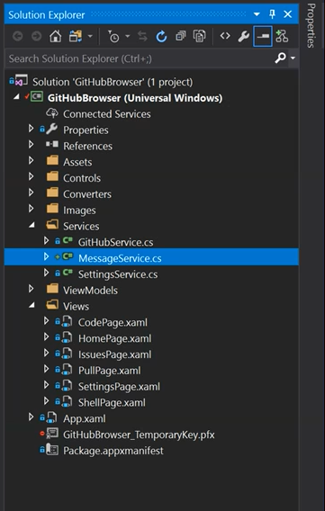
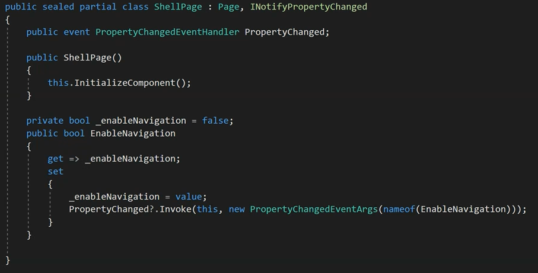
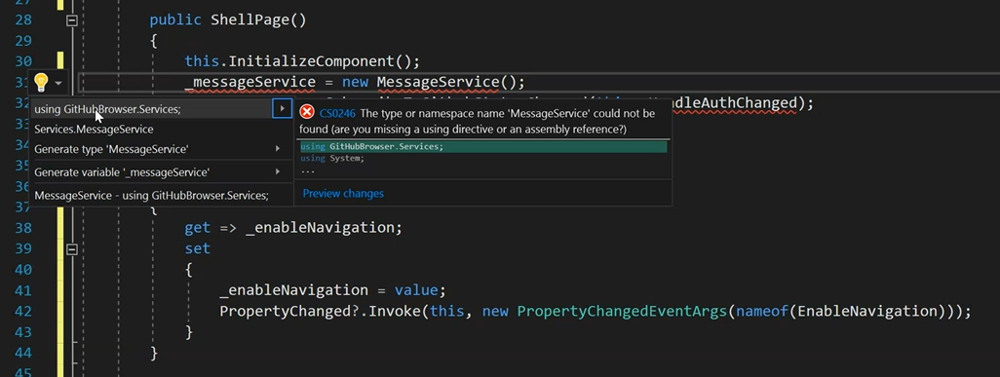
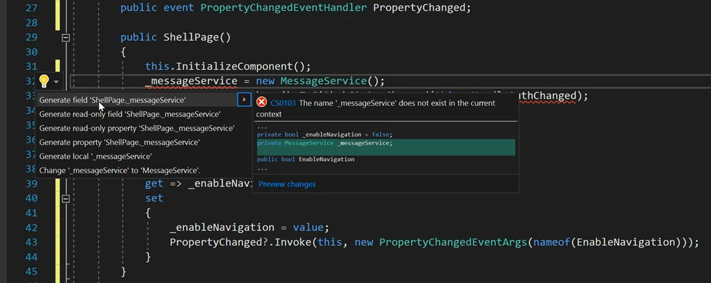
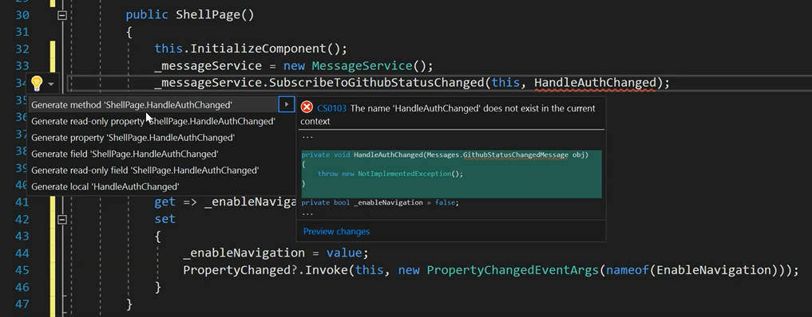
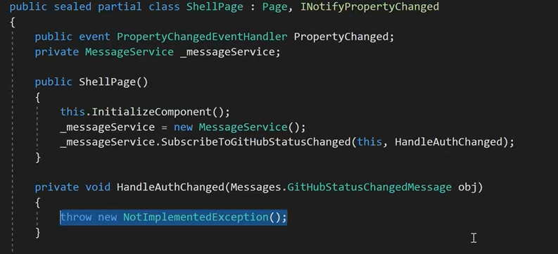
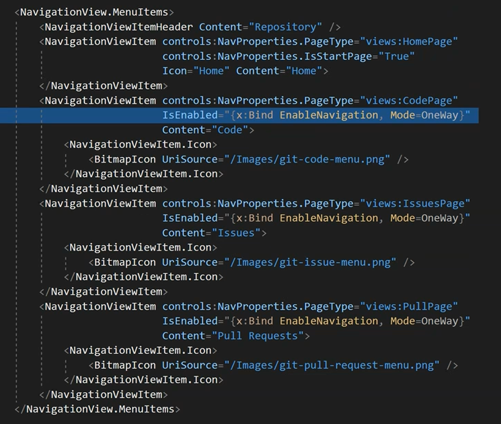
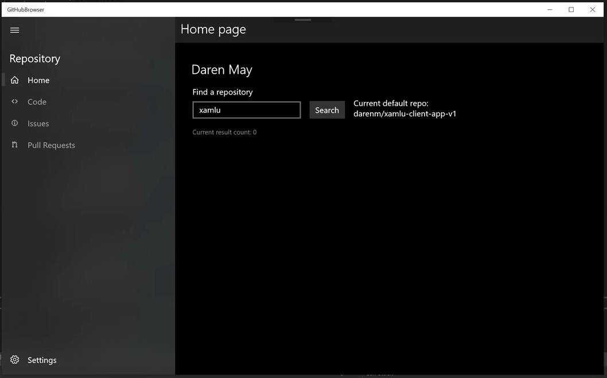
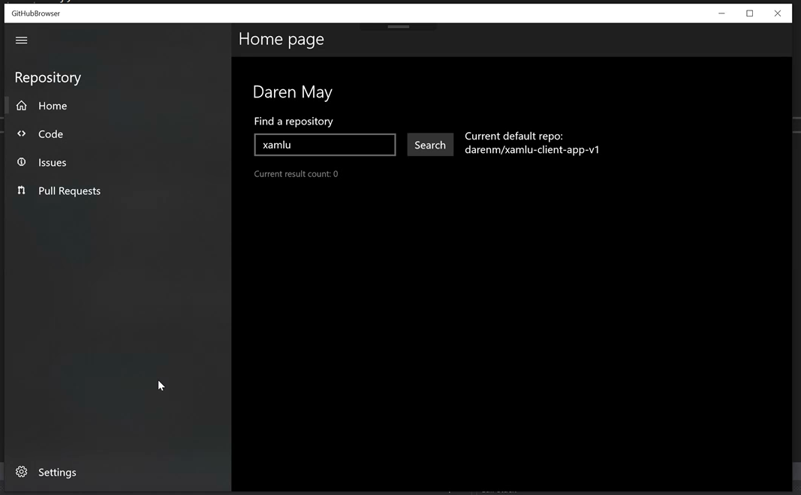

# Module 4

In this module you will explore some patterns for creating better separation of concerns between the UI and Logic and between separate areas of the application. To achieve this you will be using messaging and commands, both of which are implemented in the `MVVMLighLib` package you added earlier.

### TOC
1. [Implement messaging & commands](#messages)

In this task, we will be adding the `MessageService` and making changes throughout the app to use messages. The `MessageService` is a simplified wrapper of the MVVMLight `MessengerService` intended specifically for use in this project. As with all View Services, our `MessageService` does not expose every feature of the underlying library, it simply meets the needs of this particular project.

### Task 1: Implement Messaging & Commanding<a name="messages"></a>

1. Copy `MessageService.cs` to the `Services` folder.

    > Note: Most memory leaks in C# are from event handlers across object scopes. Objects with a resulting hard reference cannot be removed from memory by garbage collection. Using a messaging service, like the MVVMLight `MessengerService` we use here, developers can listen for messages (called subscribing) instead of events, this loose coupling side-stepping the necessity for hard references between objects. Messaging is a common pattern in XAML apps using MVVM.

    > Find the `cs` file in `Module4/Files`

    

1. In Visual Studio, add a folder `Messages` at the root level of your project.

1. Add `GitHubStatusChangedMessage.cs` in the `Messages` folder.

    The following code is the content of the message class. It is worth noting that a message can be empty, and generally is. These properties are convenience properties, but service to simplify the code of the subscriber.

    ```csharp
    namespace GitHubBrowser.Messages
    {
        public class GitHubStatusChangedMessage
        {
            public bool IsAuthenticated { get; set; }

            public string DefaultRepository { get; set; }

            public bool AllowNavigation
            {
                get
                {
                    if (!IsAuthenticated)
                        return false;
                    else if (string.IsNullOrEmpty(DefaultRepository))
                        return false;
                    else
                        return true;
                }
            }
        }
    }
    ```

1. Add an `EnableNavigation` property to `ShellPage.xaml.cs`

    1. Implement `INotifyPropertyChanged` on the class
    1. Add the `System.ComponentModel` using statment
  
   > Note: you can use the refactoring tool by hitting `CTRL+.`

    2. Raise `PropertyChanged` in the `EnableNavigation` setter.

    ```csharp
    private bool _enableNavigation = false;
    public bool EnableNavigation
    {
        get => _enableNavigation;
        set
        {
            _enableNavigation = value;
            PropertyChanged?.Invoke(this, new PropertyChangedEventArgs(nameof(EnableNavigation)));
        }
    } 
    ```

    

1. Add the following logic into the `ShellPage` class constructor

    ```csharp
    _messageService = new MessageService();
    _messageService.SubscribeToGitHubStatusChanged(this, HandleAuthChanged); 
    ```

    1. Add the namespace for `Services`

    > Note: you can use the refactoring tool by hitting `CTRL+.`

    

    1. Add the backing field for `_messageService`

    > Note: you can use the refactoring tool by hitting `CTRL+.

    

    1. Add the subscription callback method `HandleAuthChanged` for the message.

    > Note: you can use the refactoring tool by hitting `CTRL+.

    

1. Implement `HandleAuthChanged`

    

    ```csharp
    private void HandleAuthChanged(Messages.GitHubStatusChangedMessage obj)
    {
        EnableNavigation = obj.AllowNavigation;
    } 
    ```
    1. Rename parameter `obj` to `message`

    > Note: hitting `F2` will apply a rename refactor

    The `ShellPage` code-behind now implements the necessary logic to listen for the `GitHubStatusChanged` message and updates a local property we can use in our `ShellPage` UI to enable and disable navigation buttons.

1. Data bind navigation Buttons to `EnableNavigation`.

    > When the user is not logged in or when the user has not selected a default repository, the app cannot function. Handling this message and disabling navigation buttons will ensure this correct state and prevent errors in pages that rely on these values.

    Except for the `HomeButton`, add the following attribute to each `NavigationViewItem` declared in the `NavigationView.MenuItems` property. This will bind the button's `IsEnabled` status to the value of `Enablenavigation` in code-behind.

    ```sharp
    IsEnabled="{x:Bind EnableNavigation, Mode=OneWay}"
    ```

    

1. Test the app, hit `F5`

    1. Notice the navigation buttons other than Home and Settings are disabled. 

    

    > Currently, nothing sends  `GitHubStatusChangedMessage` so there is no way, yet, to enable our navigation buttons. 

1. Update `HomePageViewModel.cs`

    > There are three places where `GitHubStatusChangedMessage` should be sent. When authentication changes in `GitHubService`, when the default repository is set in `HomePageViewModel` and when the default repository is cleared in `SettingsPageViewModel`. We'll start with `HomePageViewModel`.

    1. Add `MessageService` to `HomePageViewModel`.

        In the `HomePageViewModel` constructor, instantiate a new instance of `MessageService` in a private field called `_messageService`. 

        ```csharp
        private GitHubService _gitHubService;
        private SettingsService _settingService;
        private MessageService _messageService;

        public HomePageViewModel()
        {
            ShowWaitUI = true;
            if (Windows.ApplicationModel.DesignMode.DesignModeEnabled
                || Windows.ApplicationModel.DesignMode.DesignMode2Enabled)
            {
                return;
            }
            _gitHubService = new GitHubService();
            _settingService = new SettingsService();
            _messageService = new MessageService();
        } 
        ```

    1. Send a message from `HomePageViewModel`.

        In `HomePageViewModel.MakeDefaultExecute()`, add a line sending `GitHubStatusChangedMessage` after default has been set.

        ```csharp
        private void MakeDefaultExecute()
        {
            DefaultRepository = _settingService.DefaultRepository = SelectedRepository.full_name;
            _messageService.SendGitHubStatusChanged();
        } 
        ```

1. Update `SettingsPageViewModel.cs`

    1. Add `MessageService` to `SettingsPageViewModel`.

        In the `SettingsPageViewModel` constructor, instantiate a new instance of `MessageService` in a private field called `_messageService`. 

        ```csharp
        private SettingsService _settingService;
        private GitHubService _githubService;
        private MessageService _messageService;

        public SettingsPageViewModel()
        {
            if (Windows.ApplicationModel.DesignMode.DesignModeEnabled
                || Windows.ApplicationModel.DesignMode.DesignMode2Enabled)
            {
                return;
            }
            _settingService = new SettingsService();
            _githubService = new GitHubService();
            _messageService = new MessageService();
        }   
        ```

    1. Send a message from `SettingsPageViewModel`.

        In `SettingsPageViewModel.ClearDefaultExecute()`, add a line sending `GitHubStatusChangedMessage` after default has been cleared.

        ```csharp
        private void ClearDefaultExecute()
        {
            _settingService.DefaultRepository = null;
            ClearDefaultCommand.RaiseCanExecuteChanged();
            _messageService.SendGitHubStatusChanged();
        } 
        ```

1. Update `GitHubService.cs`

    1. Add `MessageService` to `GitHubService`.

        In the `GitHubService` constructor, instantiate a new instance of `MessageService` in a private field called `_messageService`. 

        ```csharp
        private SettingsService _settingsService;
        private MessageService _messageService;

        public GitHubService()
        {
            _settingsService = new SettingsService();
            _messageService = new MessageService();
        }   
        ```

    1. Send a message from `GitHubService`.

        In the `GitHubService.IsAuthenticated` property setter, add a line sending `GitHubStatusChangedMessage` afterthe backing field has been set.

        ```csharp
        static bool _isAuthenticated;
        public bool IsAuthenticated
        {
            get => _isAuthenticated;
            set
            {
                _isAuthenticated = value;
                _messageService.SendGitHubStatusChanged();
            }
        } 
        ```

1. Test the app, hit `F5`

    1. In `Settings`, clear the default repository.
    1. Notice the navigation buttons are disabled. 
    1. In `Home`, Search for and select a default repository.
    1. Notice the nvigation buttons are enabled.

    

## Summary

In this module you refactored the application to leverage messaging and learnt how a message can be published in one area of the applications and be received in other areas, without either the publisher or the subscriber depending on each other.

In the next module, you will add functionality that will display the open and closed issues for the default repository.

[Start Module 5](./Module5.md)
