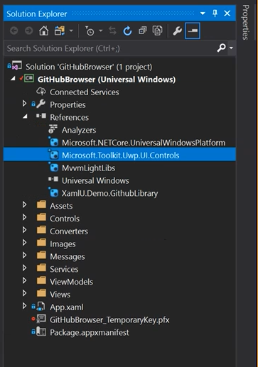
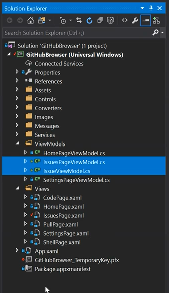
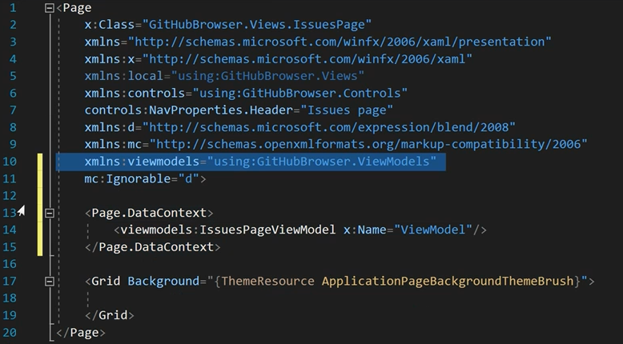
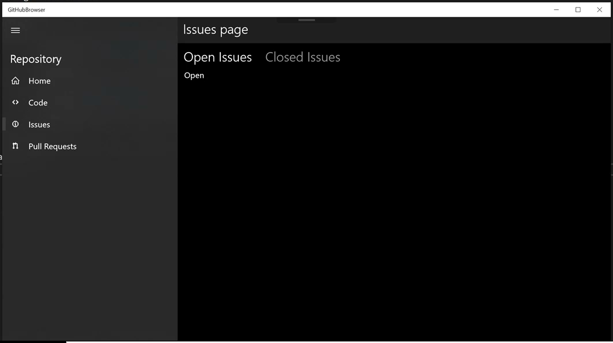
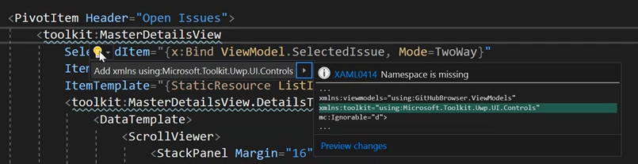

# Module 5

In this module, you will add a MasterDetail view from the UWP Toolkit and implement a page that displays the open and closed issues for a repository.

**TOC**
1. [UWP Toolkit NuGet package](#uwptoolkit)
1. [Update Issues Logic](#updatelogic)
1. [Update Issues UI](#updateui)

## Task 1: Add a reference to the UWP Toolkit NuGet package<a name="uwptoolkit"></a>

In this task, you will add the `UWP Toolkit` package to the app. 

1. Add a reference to the `UWP Toolkit` NuGet package.

    > This library introduces a set of controls built by Microsoft and the XAML community. The library includes the `MasterDetailView` which looks a little like the Mail app, and we will use later in this module. 

    > `MasterDetailView` online documentation: https://docs.microsoft.com/en-us/windows/uwpcommunitytoolkit/controls/masterdetailsview 

    1. Open the NuGet Package Manager Console
    
    

    2. Type the following into the console: `Install-Package Microsoft.Toolkit.Uwp.UI.Controls`

    

## Task 2: Update Issues Logic<a name="updatelogic"></a>

In this task, you will add the logic for the `IssuesPage` and stub out the `Pivot` UI that will be used to display open or closed issues.

1. Copy `IssueViewModel.cs` and `IssuesPageViewModel.cs` into the `ViewModels` folder.

    > Find both `cs` files in `Module5/Files`

    

    > **Instructor Sync Point:** Discuss ObservableCollection, item view-models, LINQ

1. Add a reference to `IssuesPageViewModel` in the `IssuesPage.xaml` markup, by setting the value of `Page.DataContext`, shown below. Ensure it has the name `ViewModel`.

    ```xml
    <Page.DataContext>
        <viewmodels:IssuesPageViewModel x:Name="ViewModel"/>
    </Page.DataContext>
    ```

    The XAML above will require a new xml namespace declaration to your ViewModels namespace, as shown in the image below.

    

1. Find the default `Grid` in `IssuesPage` and replace it with the XAML below:

    > Note: alternatively, this snippet can be also found in resources `Module5/Files/IssuesPage_Pivot_Snippet.txt`

    Find:  

    ```xml
    <Grid Background="{ThemeResource ApplicationPageBackgroundThemeBrush}">
      
    </Grid> 
    ```

    Replace with:

    ```xml
    <Pivot>

        <PivotItem Header="Open Issues">
            <TextBlock>Open</TextBlock>
        </PivotItem>

        <PivotItem Header="Closed Issues">
            <TextBlock>Closed</TextBlock>
        </PivotItem>

    </Pivot> 
    ```

1. Test your app, hit `F5`

    1. Click on Issues in the navigation view
    2. Pivot the Issues closed and open
    3. Notice your `TextBlocks` visibility changing

    

## Task 3: Update Issues UI<a name="updateui"></a>

In this task, you will update the `IssuesPage` UI to display the repository issues.

1. Make a control-level resources available inside the `Pivot`, but adding `ListItemTemplate` and `ItemDetailTemplate` in the `Resources` property. This is quite a bit of XAML, so copy it from the snippet file.

    A DataTemplate is a XAML type used to define the visual for a specific data type. In this case, we are defining the visual for an Issue while in a list and an Issue when displayed in detail. 

    > This snippet can be  found in resources `Module5/Files/IssuesPage_PivotResources_Snippet.txt`

    > **Instructor Sync Point:** Discuss resources and templates

1. Inside the first `PivotItem` with its `Header` set to 'Open Issues" we will replace the entire block with a block (below) containing a `MasterDetailView`, from the UWP Toolkit, which we will use to display issues and issue detail. 

    ```xml
    <PivotItem Header="Open Issues">

        <toolkit:MasterDetailsView
            SelectedItem="{x:Bind ViewModel.SelectedIssue, Mode=TwoWay}"
            ItemsSource="{x:Bind ViewModel.OpenIssues}" 
            ItemTemplate="{StaticResource ListItemTemplate}"
            DetailsTemplate="{StaticResource ItemDetailTemplate}"/>

    </PivotItem>
    ```

    We do not have the namespace for the UWP Toolkit on our page yet. Use the refactoring tools to add the XAML namespace to the UWP toolkit.

    

1. Just like the previous step: Inside the second `PivotItem` with its `Header` set to 'Closed Issues" we will replace the entire block with a block (below) containing a `MasterDetailView`, from the UWP Toolkit, which we will use to display issues and issue detail. 

    ```xml
    <PivotItem Header="Closed Issues">

        <toolkit:MasterDetailsView
            SelectedItem="{x:Bind ViewModel.SelectedIssue, Mode=TwoWay}"
            ItemsSource="{x:Bind ViewModel.ClosedIssues}" 
            ItemTemplate="{StaticResource ListItemTemplate}"
            DetailsTemplate="{StaticResource ItemDetailTemplate}"/>

    </PivotItem>
    ```

## Summary

In this module you implemented the UI and logic to display the open and closed issues for a repository. You added resources and datatemplates and used them in creating a Master/Detail view.

In the next module you will add functionality to create a new issue.

[Start Module 6](./Module6.md)
