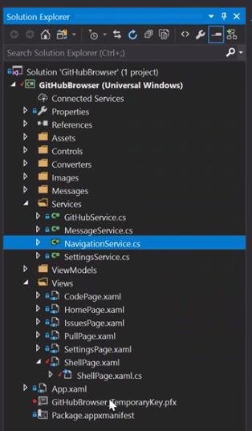
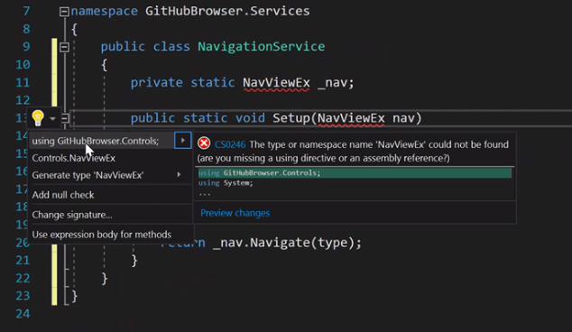
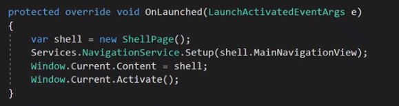
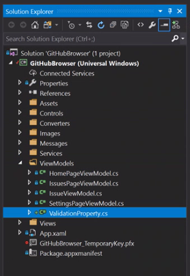
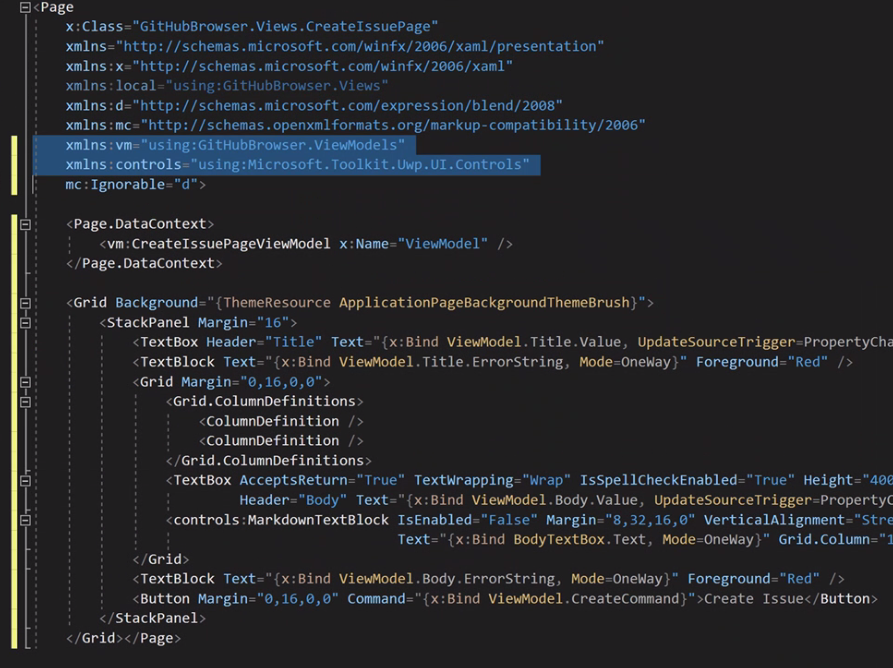
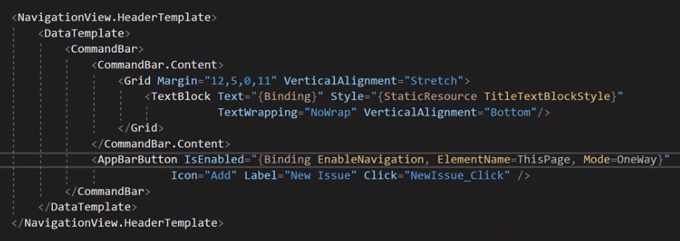
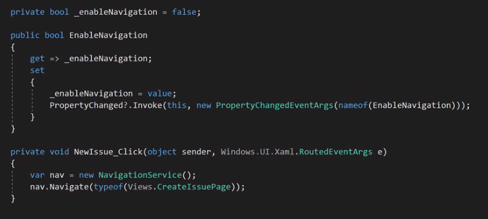
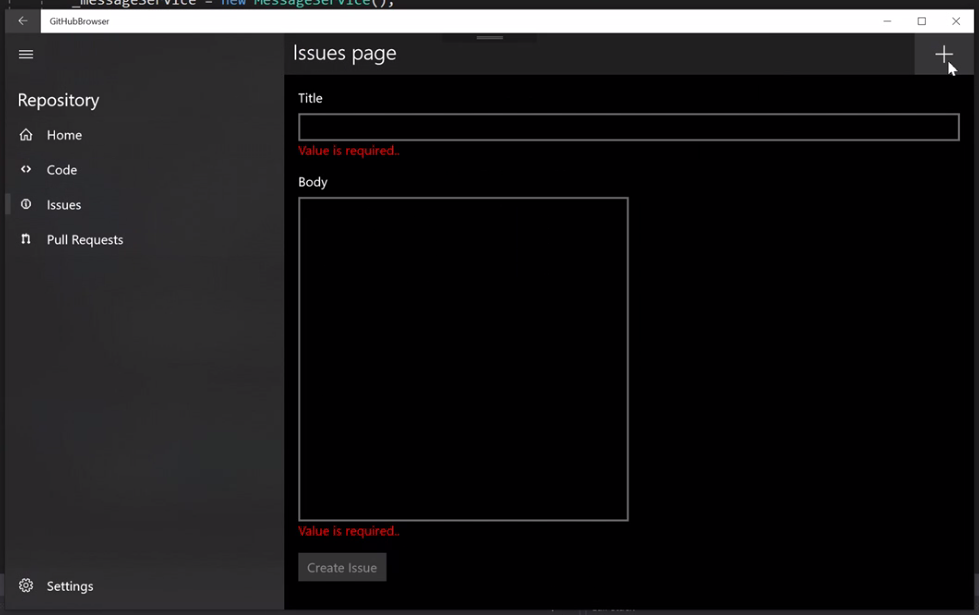

# Module 6

In this the final module you will add a `NavigationService` that will ease navigation to a new `CreateIssuePage`. You will add property validation so that you can apply business rules to data entry and finally, you will add a button that will allow the user to create an issue on the default repository.  

### TOC

1. [Navigation Service](#navigationservice)
1. [Add Validation Property Helper and Create an Issue](#validation)
1. [Global Button](#globalbutton)

## Task 1: Create and setup a Navigation Service<a name="navigationservice"></a>

In this task you will introduce a `NavigationService` and you will see how it centralizes navigation interaction.

1. Create `NavigationService.cs` in the `Services` folder.

    

1. Implement our new navigation service

  ```csharp
  public class NavigationService
  {
      private static NavViewEx _nav;

      public static void Setup(NavViewEx nav)
      {
          _nav = nav;
      }

      public bool Navigate(Type type)
      {
          return _nav.Navigate(type);
      }
  }
  ```

1. Add `using GitHubBrowser.Controls;` to our navigation service class

  > Note: you can use the refactoring tool by hitting `CTRL+.`

  

1. Open `App.xaml.cs`

1. Setup our navigation view inside `App.OnLaunched()`

  ```csharp
  Services.NavigationService.Setup(shell.MainNavigationView);
  ```

  

  > **Instructor Sync Point:** Discuss, why not setup navigation service until now?

## Task 2: Add Validation Property Helper and Create an Issue<a name="validation"></a>

In this task, you will add a validation property helper and see how to add validation to the Create Issue view model and UI.

1. Copy `ValidationProperty.cs` into the `ViewModels` folder.

    > Find the `cs` file in `Module6/Files`

    


1. Copy `CreateIssuePageViewModel.cs` into the `ViewModels` folder.

    > Find the `cs` file in `Module6/Files`

  > **Instructor Sync Point:** Discuss validation property and the problems of validation

1. Create `CreateIssuePage.xaml` in the `Views` folder.

1. Find the default `Grid` in `CreateIssuePage` and replace it with the XAML below:

  > Note: alternatively, this snippet can be also found in resources `Module6/Files/CreateIssuePage_Snippet.txt`

  Find:  

  ```xml
  <Grid Background="{ThemeResource ApplicationPageBackgroundThemeBrush}">
    
  </Grid> 
  ```

  Replace with:
  ```xml
  <Page.DataContext>
      <vm:CreateIssuePageViewModel x:Name="ViewModel" />
  </Page.DataContext>

  <Grid Background="{ThemeResource ApplicationPageBackgroundThemeBrush}">
      <StackPanel Margin="16">
          <TextBox Header="Title" Text="{x:Bind ViewModel.Title.Value, UpdateSourceTrigger=PropertyChanged, Mode=TwoWay}" HorizontalAlignment="Stretch" />
          <TextBlock Text="{x:Bind ViewModel.Title.ErrorString, Mode=OneWay}" Foreground="Red" />
          <Grid Margin="0,16,0,0">
              <Grid.ColumnDefinitions>
                  <ColumnDefinition />
                  <ColumnDefinition />
              </Grid.ColumnDefinitions>
              <TextBox AcceptsReturn="True" TextWrapping="Wrap" IsSpellCheckEnabled="True" Height="400" Header="Body"   Text="{x:Bind ViewModel.Body.Value, UpdateSourceTrigger=PropertyChanged, Mode=TwoWay}" x:Name="BodyTextBox" HorizontalAlignment="Stretch" />
              <controls:MarkdownTextBlock IsEnabled="False" Margin="8,32,16,0" VerticalAlignment="Stretch" Text="{x:Bind BodyTextBox.Text, Mode=OneWay}" Grid.Column="1" />
          </Grid>
          <TextBlock Text="{x:Bind ViewModel.Body.ErrorString, Mode=OneWay}" Foreground="Red" />
          <Button Margin="0,16,0,0" Command="{x:Bind ViewModel.CreateCommand}">Create Issue</Button>
      </StackPanel>
  </Grid>
  ```

  > Note: alternatively, this snippet can be also found in resources `Module6/Files/CreateIssuePage.xaml`

  > **Instructor Sync Point:** Discuss navigation view (line 50)

1. Ensure there is a namespace reference to `Controls` and `ViewModels`

  ```xml
  xmlns:vm="using:GitHubBrowser.ViewModels"
  xmlns:controls="using:Microsoft.Toolkit.Uwp.UI.Controls"
  ```

  

## Task 3: Global Button<a name="globalbutton"></a>

In this task, you will add a global "create issue" button to the page title command bar. This button will navigate the user to a new `CreateIssuePage` that will show a method for validating data input in the UI.

1. Open `ShellPage.xaml`

1. Insert an `AppBarButton` into our top `CommandBar`

  ```xml
  <AppBarButton 
    IsEnabled="{Binding EnableNavigation, ElementName=ThisPage, Mode=OneWay}"
    Icon="Add" Label="New Issue" Click="NewIssue_Click" />
  ```

  

1. Open `ShellPage.xaml.cs`

1. Insert a click handler for our new button 

  ```csharp
  private void NewIssue_Click(object sender, Windows.UI.Xaml.RoutedEventArgs e)
  {
      var nav = new NavigationService();
      nav.Navigate(typeof(Views.CreateIssuePage));
  }
  ```

  

  > **Instructor SyncPoint:** Discuss element binding

1. Test the app, hit `F5`

    1. Set and clear the `default repository`
    1. Notice the top button enabling and disabling accordingly
    1. Go to `Issues`
    1. Notice the existing issues
    1. Click the `top button` to add an issue
    1. Notice the `back button` in the shell
    1. Click the `top button` again
    1. Notice the field-level validation requirements
    1. Fill in both `Title` and `Body`
    1. Notice the `Create Issue` button is now enabled
    1. Optional: add mark down in the `Body`
    1. Create an `Issue`

  

## Summary

And that's it - the end of the module and the end of the course! In this module you added the feature to create an issue for the default repository and immplemented an approach for validating data input. Over the 6 modules of the course, you built an app that:

* Leverages NuGet packages
* Integrates with 3rd party web apis
* Authenticated using OAuth
* Built a number of XAML layouts for the UI
* Implemented an MVVM architecture
* Utilized patterns for loose-coupling such as data-binding, messages and commands.
* Implemented a custom data input validation approach
